## 🔹 About

Spaceman is an application for macOS that allows you to view your Spaces (Virtual Desktops) in the menu bar. Spaceman allows you to see which space you are currently on (or spaces if you are using multiple displays) relative to the other spaces you have. Naming these spaces is also an option in order to organise separate spaces for your workflow.

Also, the menu and menu bar icons enable switching between spaces.

**Spaceman requires macOS 13 Ventura or greater.**

**For switching spaces, Spaceman requires Accessibility and Automation permissions**
([see below](#setup-requirements)).

## 🔹 Installation

### Through GitHub

Go to the [releases](https://github.com/ruittenb/Spaceman/releases) tab and download **Spaceman.dmg** from the latest release.
Double-click the dmg file and drag `Spaceman.app` to the `Applications` folder.

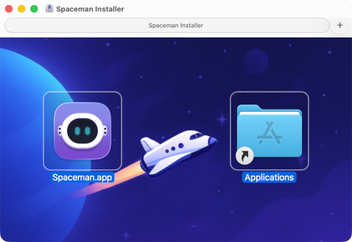

### Through Homebrew

```sh
$ brew install --cask ruittenb/tap/spaceman
```

### Launching Spaceman

When launching Spaceman, you may run into this message. Open the System Settings → Privacy & Security and click "Open Anyway".

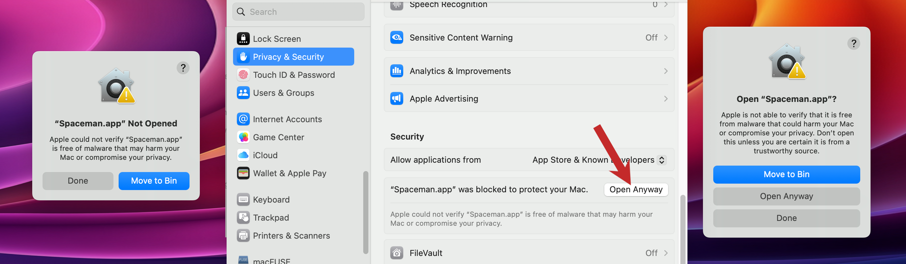

## 🔹 What It Looks Like

You can choose between Filled or Bordered view:


Icons can be rectangular, rounded, or pill-shaped. Fullscreen spaces automatically use a contrasting shape so they are easy to tell apart.

You can assign colors to each space button:


You can choose variable width icons or mostly-equal width icons:


You can choose to display just numbers instead of the entire names, or even just rectangles:


Icons can have Round and Pill shapes:


The icon font can be changed:


You can use emoji to identify spaces!

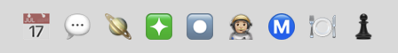

For ultra-compact mode, choose the Two Rows layout:

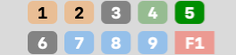


Full Unicode support:

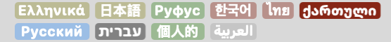

Optional navigation buttons let you switch to the previous/next space or
open Mission Control directly from the menu bar:


You can choose to display all spaces or just a few neighboring ones; and to hide Fullscreen spaces entirely.

## 🔹 Preferences

Spaceman's preferences are organized into four tabs: **General**, **Appearance**, **Spaces**, and **Displays**.

### General Tab

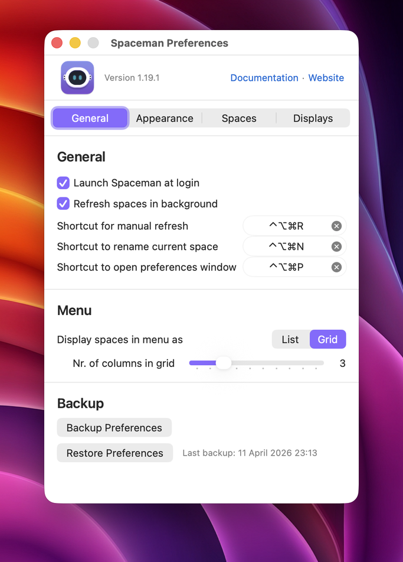

- **Launch Spaceman at login**: Automatically start Spaceman when you log in to macOS
- **Refresh spaces in background**: If enabled, Spaceman will update the view when your space configuration changes
- **Shortcut for manual refresh**: Defines a shortcut key to tell Spaceman to update the space information
- **Shortcut to rename current space**: Defines a shortcut key to quickly rename the current space without opening Preferences
- **Shortcut to open preferences window**: Defines a shortcut key to open the preferences window. The preferences window can be closed with ⌘W

- **Display spaces in menu as**: Choose between a list or a grid layout for the right-click menu
- **Nr. of columns in grid**: When using grid layout, this sets the number of columns
- **Backup Preferences**: Saves all your preferences to `~/.spaceman/app-defaults.xml` (old copies are preserved)
- **Restore Preferences**: Loads preferences from that file

**Spaceman reads keyboard shortcuts directly from your system settings** — no manual configuration needed.

### Appearance Tab

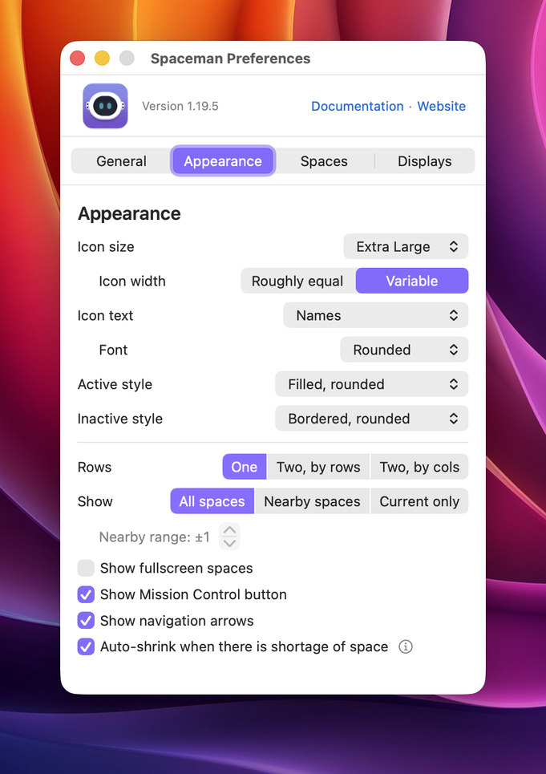

- **Icon size**: Adjusts the size of the space icons in the menu bar
- **Icon width**: Switches between:
  - roughly equal icon widths (short names are padded to match the longest, but fullscreen names are disregarded), or
  - variable widths (each icon sized to its own content)
- **Icon text**: Selects whether to show space numbers and/or names in the icons
  - **Font**: Choose from four main font styles
- **Active style** / **Inactive style**: Choose the shape and fill for active and inactive space icons
- **Rows**: Choose single row, or two rows filled by rows or by columns:

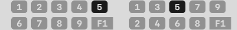

- **Spaces shown**: Selects which spaces are shown in the menu bar: all, a few, or just the current one
- **Nearby range**: With "Nearby spaces", this determines how many spaces will be shown
- **Show fullscreen spaces**: Shows or hides fullscreen app spaces from the menu bar
- **Show Mission Control button**: Adds a button to open Mission Control to the menu bar
- **Show navigation arrows**: Adds buttons to the menu bar for switching to previous/next space
- **Auto-shrink**: When the menu bar icon is too wide to fit, Spaceman progressively shrinks it:
  first to compact numbers-only, then to the app icon.
  The icon unshrinks automatically when you switch spaces, trigger a manual refresh, or click the app icon.
  Enabled by default.

### Spaces Tab

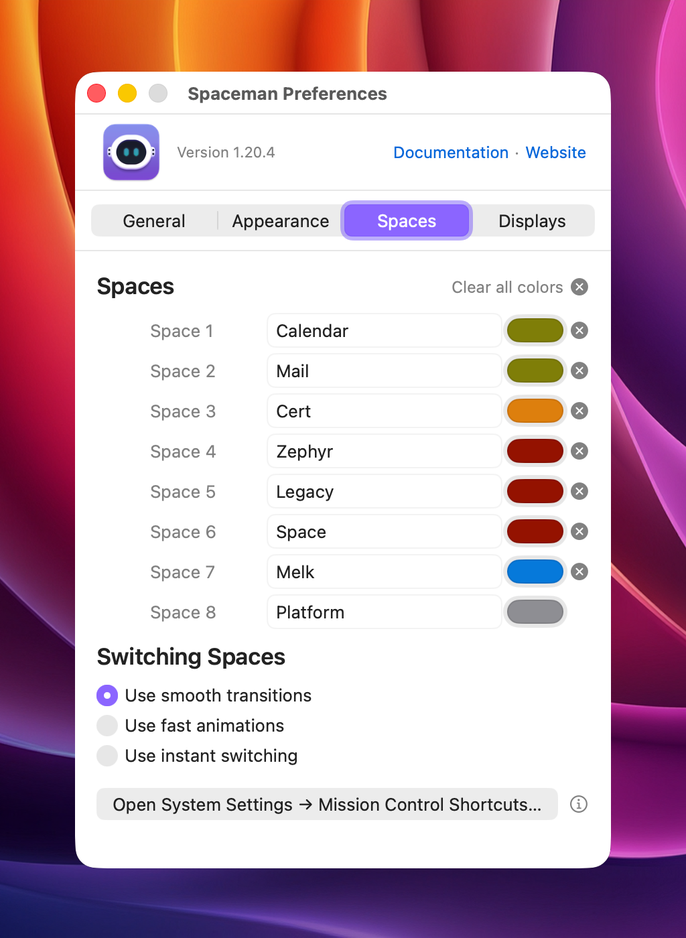

- **Space names**: Assigns custom names of any length to individual spaces
  - The menu displays full names regardless of length
  - Menu bar icons truncate names to 10 characters for compactness
  - Optionally, for each Space icon, a color can be selected.
- **Switching Spaces**: Controls how Spaceman switches between spaces when you click a space icon:
  - **Use smooth transitions**: Sends keyboard shortcuts to macOS, which switches spaces with the standard sliding animation. Requires Mission Control shortcuts to be configured in System Settings.
  - **Use fast animations**: Uses simulated trackpad gestures to switch spaces with a faster animation. Does not require shortcuts to be configured. Only works for spaces on the same display.
  - **Use instant switching**: Uses simulated trackpad gestures to switch spaces with no animation at all. Does not require shortcuts to be configured. Only works for spaces on the same display.
  - When using fast or instant switching and the target space is on a different display, Spaceman falls back to keyboard shortcuts automatically.
- **Open System Settings → Mission Control Shortcuts**: Opens the System Settings panel for the Keyboard. Click [Shortcuts] and [Mission Control] to manage them.

### Displays Tab

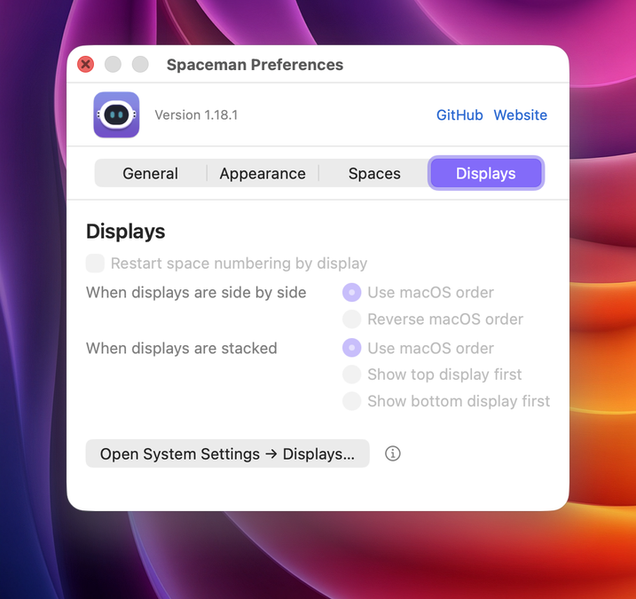

- **Restart space numbering by display**: For each display, Space numbering starts at 1, instead of using continuous numbering
- **When displays are side by side**: Use macOS display order or reverse it
- **When displays are stacked**: macOS standard is to sort displays by the X coordinate of their center. This option enables sorting by Y coordinate
- **Open System Settings → Displays**: Opens the System Settings panel for Displays. Click [Arrange] to adjust the arrangement of the displays

## 🔹 Switching Spaces

Spaceman provides multiple ways to switch between spaces quickly and efficiently.

### Setup Requirements

For space switching to work, you need to configure two things:

**1. Accessibility and Automation Permissions**
- Go to **System Settings → Privacy & Security → Accessibility**
- Add Spaceman to the list of allowed applications.†
- Enable the checkbox next to Spaceman


- Go to **System Settings → Privacy & Security → Automation**
- Add Spaceman to the list of allowed applications.†
- Enable the checkbox next to Spaceman

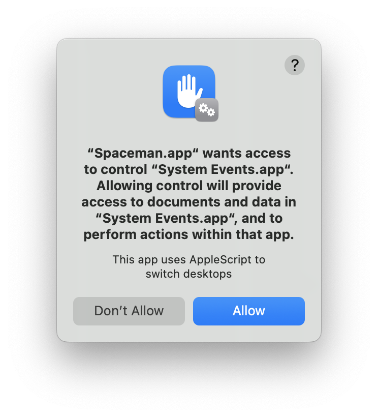
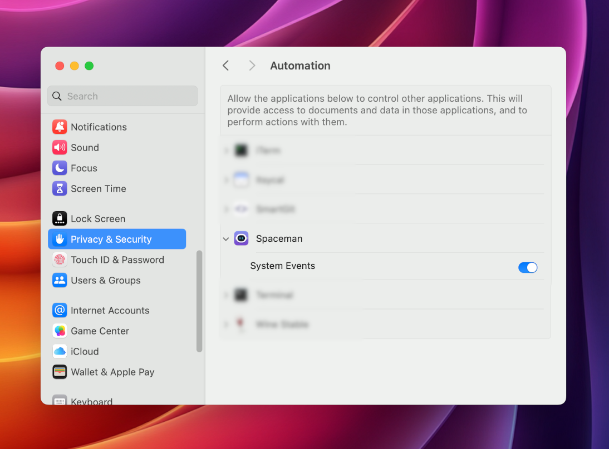

† If you are updating from a previous version, you may need to remove and re-add Spaceman to grant permissions to the new version.

**2. Mission Control Shortcuts**
- Go to **System Settings → Keyboard → Keyboard Shortcuts → Mission Control**
- Assign and enable shortcuts for the following, if you want to use them:
  - "Switch to Desktop" for any spaces you want to be able to switch to
  - "Move left/right a space" for navigation buttons


### Usage Methods

**Navigation Buttons**
- Optionally show arrow buttons and a Mission Control button in the menu bar
- Arrow buttons switch to the previous or next space
- The Mission Control button opens Mission Control
- Enable these in Preferences → Appearance or via the right-click menu → Buttons Shown


**Menu Bar Clicking**
- Click directly on any space icon in the menu bar to switch to that space
- Current space is highlighted and cannot be clicked
- Clicking an unavailable space flashes the menu bar

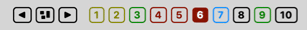

**Menu Selection**
- Right-click the Spaceman icon to open the context menu.
  - Depending on your preferences, the spaces are shown as a list or as a grid
- Click on any space from the list or grid to switch to it
- Menu shows full space names and indicates the current space

Some appearance settings are also available directly from this menu.

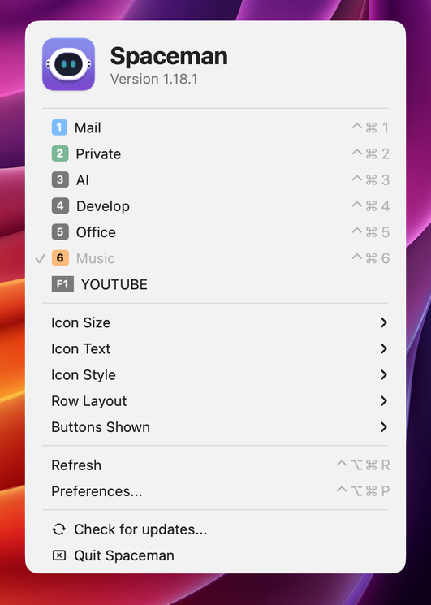

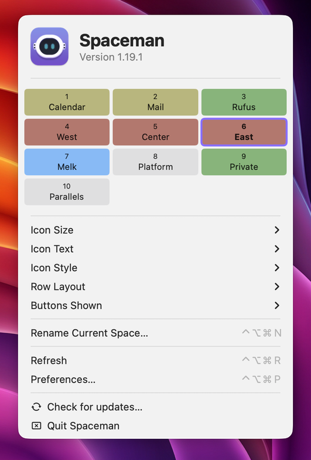

**Quick Rename Current Space**
- Rename the current space on the fly via the right-click menu ("Rename Current Space…") or a configurable keyboard shortcut
- A small dialog appears with the current name pre-filled; press Enter to confirm or Escape to cancel

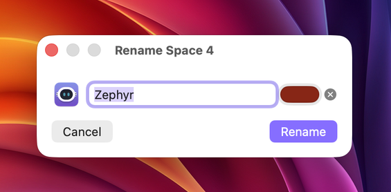

**Resizing the Icon**
- Hold **⌥ Option** and scroll on the menu bar icon to quickly change the icon size

**Keyboard Shortcuts**
- When **Smooth transitions** is selected, Spaceman reads keyboard shortcuts directly from macOS Mission Control settings and sends the corresponding keystrokes. You are free to choose these shortcuts however you like.
- Desktops 1–16 are supported.
- Mission Control doesn't have keyboard shortcuts for switching to fullscreen spaces. With "Allow switching to fullscreen spaces in multiple steps" turned on, Spaceman can reach them by chaining arrow keypresses.

### Limitations

- Space switching will fail without proper Accessibility permissions

## 🔹 Remote Control

Spaceman supports AppleScript commands for remote control:

```sh
$ osascript -e 'tell application "Spaceman" to refresh' # Refresh the Spaces Icon
$ osascript -e 'tell application "Spaceman" to open preferences' # Open Preferences Window
$ osascript -e 'tell application "Spaceman" to restore preferences' # Restore Preferences from Backup
```

It also exposes read-only properties that can be queried:

```sh
$ osascript -e 'tell application "Spaceman" to get current space number'   # e.g. 3
$ osascript -e 'tell application "Spaceman" to get current space name'     # e.g. "Mail"
$ osascript -e 'tell application "Spaceman" to get current display number' # e.g. 1
$ osascript -e 'tell application "Spaceman" to get display count'          # e.g. 2
```

With multiple displays, `current space number` and `current space name` return the current space on the frontmost display.
For `display count`, mirrored displays count as one.

These commands and properties can be used in automation tools like Alfred, Keyboard Maestro, or custom scripts.
For details on how to make good use of 'refresh', see [MikeJL's Comments](README-Yabai.md)

## 🔹 Troubleshooting

- If Spaceman does not start, or does not run correctly, after an upgrade:
you may need to delete the application defaults:

```sh
$ defaults delete dev.ruittenb.Spaceman
```

- If Spaceman assigns the desktop names wrong:
Spaceman is not compatible with the setting **System Settings → Desktop & Dock → Mission Control → Automatically rearrange Spaces based on most recent use**. You should turn this setting off.

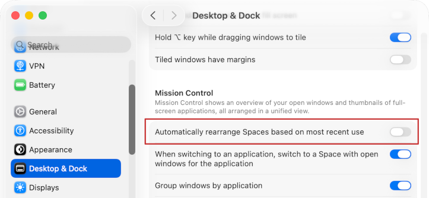


## 🔹 Attributions

- This project was forked from [Sasindu Jayasinghe](https://github.com/Jaysce/Spaceman)
- This project is based on [WhichSpace](https://github.com/gechr/WhichSpace)
- This project takes inspiration from [InstantSpaceSwitcher](https://github.com/jurplel/InstantSpaceSwitcher)
- This project uses [Sparkle](https://sparkle-project.org) for update delivery
- This project makes use of [LaunchAtLogin](https://github.com/sindresorhus/LaunchAtLogin)
- This project makes use of [KeyboardShortcuts](https://github.com/sindresorhus/KeyboardShortcuts)
- Authors:
  - [Sasindu Jayasinghe](https://github.com/Jaysce/Spaceman)
  - [René Uittenbogaard](https://github.com/ruittenb/Spaceman)
- Contributions by:
  - [Waylon Wang](https://github.com/waylonwang/Spaceman)
  - [ultravioletcatastrophe](https://github.com/ultravioletcatastrophe/Spaceman)
  - [Nicomalacho](https://github.com/Nicomalacho/Spaceman)
  - [DonBox](https://github.com/donbox/Spaceman)
  - [Dmitry Poznyak](https://github.com/triangular-sneaky/Spaceman)
  - [Grzegorz Milka](https://github.com/gregorias/Spaceman)
  - [Michael Lehenauer](https://github.com/mike-jl/Spaceman)
  - [Logan Savage](https://github.com/lxsavage/Spaceman)
  - [Yakir Lugasy](https://github.com/yakirlog/Spaceman)
  - [aaplmath](https://github.com/aaplmath)

## 🔹 Mentions

- [Softpedia](https://mac.softpedia.com/get/System-Utilities/Spaceman.shtml)

## 🔹 Similar projects

- [SpaceId](https://github.com/dshnkao/SpaceId/)
  - [SpaceId fork](https://github.com/davidpurnell/SpaceId)


