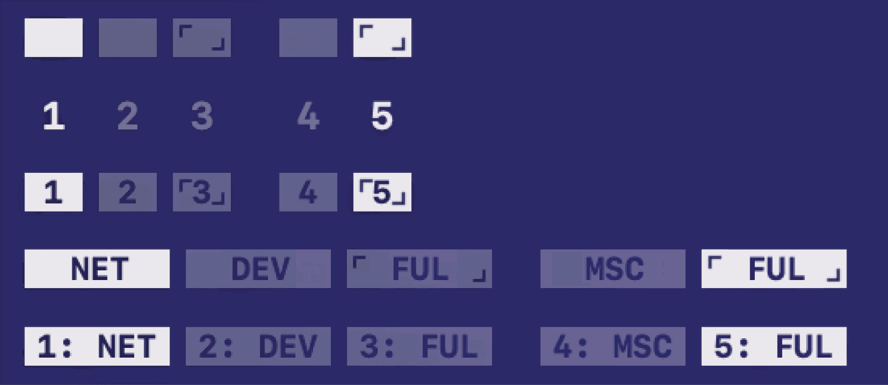
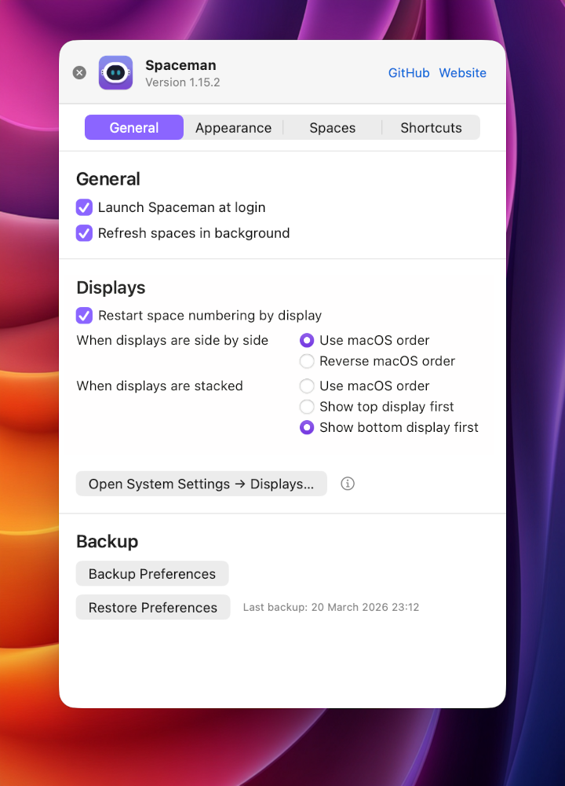
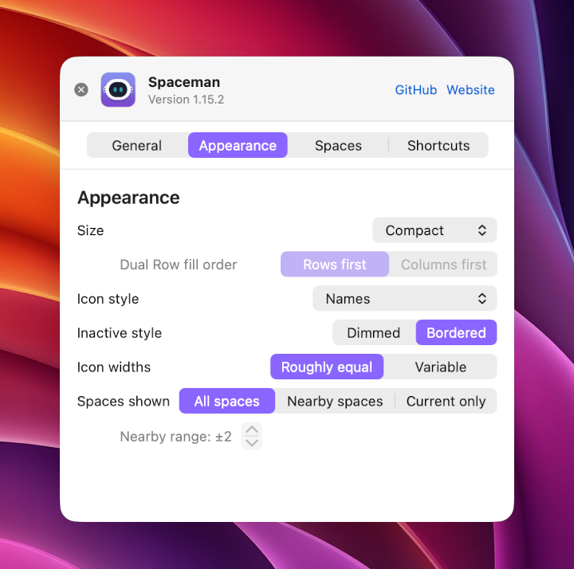
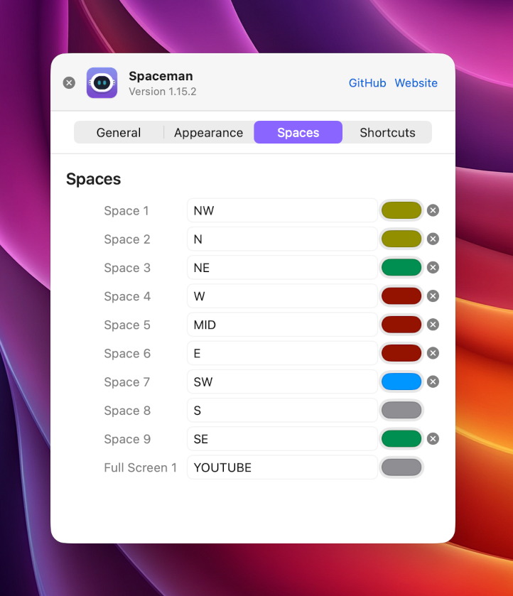
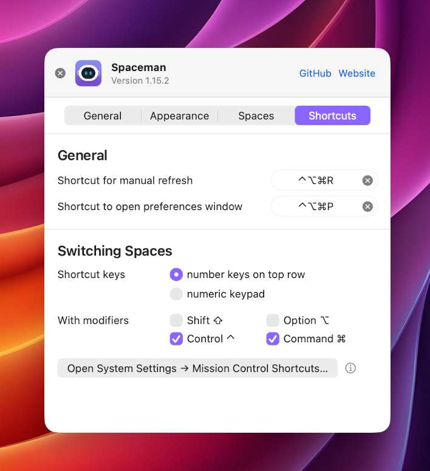
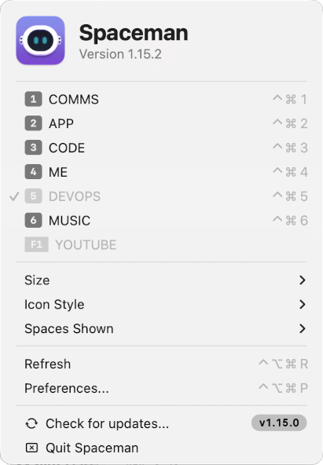

## 🔹 About

Spaceman is an application for macOS that allows you to view your Spaces (Virtual Desktops) in the menu bar. Spaceman allows you to see which space you are currently on (or spaces if you are using multiple displays) relative to the other spaces you have. Naming these spaces is also an option in order to organise separate spaces for your workflow.

Also, the menu and menu bar icons enable switching between spaces.

**Spaceman requires macOS 13 Ventura or greater.**

**For switching spaces, Spaceman requires Accessibility and Automation permissions**
([see below](#setup-requirements)).

## 🔹 Installation

### Through GitHub

Go to the [releases](https://github.com/ruittenb/Spaceman/releases) tab and download **Spaceman.dmg** from the latest release.
Double-click the dmg file and drag `Spaceman.app` to the `Applications` folder.


### Through Homebrew

```sh
$ brew install --cask ruittenb/tap/spaceman
```

### Launching Spaceman

When launching Spaceman, you may run into this message. Open the System Settings → Privacy & Security and click "Open Anyway".


## 🔹 Understanding the Icons



Spaceman displays your spaces as icons in the menu bar. The image above shows examples of the five different icon styles available.

### Icon States

The meaning of the icons from left to right in the example:

- **Active Space**: The space you're currently on (highlighted)
- **Inactive Space**: Regular spaces you can switch to
- **Inactive Fullscreen App**: A space with a fullscreen application
- **Gap**: Indicates that the following spaces are on a different display
- **Inactive Space**: Another regular space on the second display
- **Active Fullscreen App**: Current space with a fullscreen application

### Icon Styles

From top to bottom, you can see examples of the five different icon styles:

- **Rectangles**: Plain rectangles
- **Bare Numbers**: Plain numbers, not boxed
- **Numbers**: Numbers in a rectangular box
- **Names**: Custom text labels for each space
- **Names with Numbers**: Combined custom names and numbers

## 🔹 Preferences

Spaceman's preferences are organized into four tabs: **General**, **Appearance**, **Spaces**, and **Shortcuts**.

### General Tab



- **Launch Spaceman at login**: Automatically start Spaceman when you log in to macOS
- **Refresh spaces in background**: If enabled, Spaceman will update the view when your space configuration changes
- **Restart space numbering by display**: For each display, Space numbering starts at 1, instead of using continuous numbering
- **When displays are side by side**: Use macOS display order or reverse it
- **When displays are stacked**: macOS standard is to sort displays by the X coordinate of their center. This option enables sorting by Y coordinate
- **Open System Settings → Displays**: Opens the System Settings panel for Displays. Click [Arrange] to adjust the arrangement of the displays
- **Backup Preferences**: Saves all your preferences to `~/.spaceman/app-defaults.xml` (old copies are preserved)
- **Restore Preferences**: Loads preferences from that file

### Appearance Tab



- **Size**: Adjusts icon and font sizes for the menu bar
- **Dual Row fill order**: When using Dual Row layout, choose whether to fill rows first or columns first:


- **Icon text**: Selects one of the five visual icon styles described in [Understanding the Icons](#-understanding-the-icons)
- **Inactive style**: Choose between dimmed (reduced opacity) or bordered (outlined) inactive spaces
- **Icon widths**: Switches between:
  - roughly equal icon widths (short names are padded to match the longest, but fullscreen names are disregarded), or
  - variable widths (each icon sized to its own content)
- **Spaces shown**: Selects which spaces are shown in the menu bar: all, a few, or just the current one
- **Nearby range**: With "Nearby spaces", this determines how many spaces will be shown

### Spaces Tab



- **Space names**: Assigns custom names of any length to individual spaces
  - The menu displays full names regardless of length
  - Menu bar icons truncate names to 10 characters for compactness
  - Optionally, for each Space icon, a color can be selected.

### Shortcuts Tab



- **Shortcut for manual refresh**: Defines a shortcut key to tell Spaceman to update the space information
- **Shortcut to open preferences window**: Defines a shortcut key to open the preferences window. The preferences window can be closed with ⌘W
- **Switching keys** and **Modifiers**: Tell Spaceman which shortcut keys have been defined in Mission Control for switching spaces.
- **Open System Settings → Mission Control Shortcuts**: Opens the System Settings panel for the Keyboard. Click [Shortcuts] and [Mission Control] to define these.

## 🔹 Switching Spaces

Spaceman provides multiple ways to switch between spaces quickly and efficiently.

### Setup Requirements

For space switching to work, you need to configure three things:

**1. Accessibility and Automation Permissions**
- Go to **System Settings → Privacy & Security → Accessibility**
- Add Spaceman to the list of allowed applications.†
- Enable the checkbox next to Spaceman


- Go to **System Settings → Privacy & Security → Automation**
- Add Spaceman to the list of allowed applications.†
- Enable the checkbox next to Spaceman


† If you are updating from a previous version, you may need to remove and re-add Spaceman to grant permissions to the new version.

**2. Mission Control Shortcuts**
- Go to **System Settings → Keyboard → Keyboard Shortcuts → Mission Control**
- Assign keyboard shortcuts to "Switch to Desktop 1", "Switch to Desktop 2", etc.
- Make sure shortcuts are enabled for the spaces you want to access


**3. Spaceman Shortcut Configuration**
- Open Spaceman preferences and go to the **Spaces** tab
- Under "Switching Spaces", select your preferred shortcut scheme:
  - **Number keys on top row**: Uses keys 1-9, 0 for spaces 1-10
  - **Numeric keypad**: Uses numpad keys
- Add the modifier keys (Shift, Control, Option, Command) that Mission Control has been configured to use

### Usage Methods

**Menu Bar Clicking**
- Click directly on any space icon in the menu bar to switch to that space
- Current space is highlighted and cannot be clicked
- Clicking an unavailable space flashes the menu bar


**Menu Selection**
- Right-click the Spaceman icon to open the context menu
- Select any space from the list to switch to it
- Menu shows full space names and indicates the current space with a checkmark



**Keyboard Shortcuts**
- Spaceman does not do the space switching itself, but sends shortcut keystrokes to Mission Control.
  - Switching between spaces is then handled by Mission Control directly.
- The first 10 regular spaces will send shortcuts with numbers (1-9, 0)

### Limitations

- Spaces beyond the first 10 cannot be switched to via keyboard shortcuts
- Mission Control doesn't have the capability to switch to fullscreen spaces
- Space switching will fail without proper Accessibility permissions

## 🔹 Remote Control

Spaceman supports AppleScript commands for remote control:

```sh
$ osascript -e 'tell application "Spaceman" to refresh' # Refresh the Spaces Icon
$ osascript -e 'tell application "Spaceman" to open preferences' # Open Preferences Window
$ osascript -e 'tell application "Spaceman" to restore preferences' # Restore Preferences from Backup
```

These commands can be used in automation tools like Alfred, Keyboard Maestro, or custom scripts.
For details on how to maximize usefulness of 'refresh', see [MikeJL's Comments](README-Yabai.md)

## 🔹 Troubleshooting

- If Spaceman does not start, or does not run correctly, after an upgrade:
you may need to delete the application defaults:

```sh
$ defaults delete dev.ruittenb.Spaceman
```

- If Spaceman assigns the desktop names wrong:
Spaceman is not compatible with the setting **System Settings → Desktop & Dock → Mission Control → Automatically rearrange Spaces based on most recent use**. You should turn this setting off.


## 🔹 Attributions

- This project was forked from [Sasindu Jayasinghe](https://github.com/Jaysce/Spaceman)
- This project is based on [WhichSpace](https://github.com/gechr/WhichSpace)
- This project uses [Sparkle](https://sparkle-project.org) for update delivery
- This project makes use of [LaunchAtLogin](https://github.com/sindresorhus/LaunchAtLogin)
- This project makes use of [KeyboardShortcuts](https://github.com/sindresorhus/KeyboardShortcuts)
- Authors:
  - [Sasindu Jayasinghe](https://github.com/Jaysce/Spaceman)
  - [René Uittenbogaard](https://github.com/ruittenb/Spaceman)
- Contributions by:
  - [Waylon Wang](https://github.com/waylonwang/Spaceman)
  - [ultravioletcatastrophe](https://github.com/ultravioletcatastrophe/Spaceman)
  - [Nicomalacho](https://github.com/Nicomalacho/Spaceman)
  - [Dmitry Poznyak](https://github.com/triangular-sneaky/Spaceman)
  - [Grzegorz Milka](https://github.com/gregorias/Spaceman)
  - [Michael Lehenauer](https://github.com/mike-jl/Spaceman)
  - [Logan Savage](https://github.com/lxsavage/Spaceman)
  - [Yakir Lugasy](https://github.com/yakirlog/Spaceman)
  - [aaplmath](https://github.com/aaplmath)

## 🔹 Mentions

- [Softpedia](https://mac.softpedia.com/get/System-Utilities/Spaceman.shtml)

