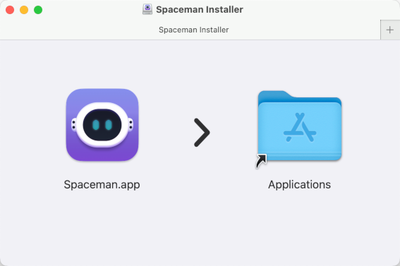

## 🔹 About

Spaceman is an application for macOS that allows you to view your Spaces / Virtual Desktops in the menu bar. Spaceman allows you to see which space you are currently on (or spaces if you are using multiple displays) relative to the other spaces you have. Naming these spaces is also an option in order to organise separate spaces for your workflow.

Also, the menu and menu bar icons enable switching between spaces.

**Spaceman requires macOS 11 Big Sur or greater.**

**For switching spaces, Spaceman requires Accessibility and Automation permissions**
([see below](#setup-requirements)).

## 🔹 Installation

### Through GitHub

Go to the [releases](https://github.com/ruittenb/Spaceman/releases) tab and download **Spaceman.dmg** from the latest release.
Double-click the dmg file and drag `Spaceman.app` to the `Applications` folder.



### Through Homebrew

```sh
$ brew install --cask ruittenb/tap/spaceman
```

## 🔹 Understanding the Icons


Spaceman displays your spaces as icons in the menu bar. The image above shows examples of the five different icon styles available.

### Icon States

The meaning of the icons from left to right in the example:

- **Active Space**: The space you're currently on (highlighted)
- **Inactive Space**: Regular spaces you can switch to
- **Inactive Fullscreen App**: A space with a fullscreen application
- **Gap**: Indicates that the following spaces are on a different display
- **Inactive Space**: Another regular space on the second display
- **Active Fullscreen App**: Current space with a fullscreen application

### Icon Styles

From top to bottom, you can see examples of the five different icon styles:

- **Rectangles**: Plain rectangles
- **Numbers**: Plain numbers
- **Rectangles with Numbers**: Numbers in a rectangle
- **Names**: Custom text labels for each space
- **Names with Numbers**: Combined custom names and numbers

## 🔹 Preferences

Spaceman's preferences are organized into two main tabs: **General** and **Spaces**.

### General Tab

**App Behavior**
- **Launch at login**: Automatically start Spaceman when you log in to macOS
- **Auto-refresh**: Enables refreshing space information in the background at regular intervals
- **Manual refresh shortcut**: Defines a shortcut key to trigger an update of the space information

**Display & Layout**
- **Layout sizes**: Selects icon and font sizes for the menu bar.

**Keyboard Shortcuts**
- **Shortcut keys** and **Modifiers**: Tells Spaceman which shortcut keys have been defined in Mission Control for switching spaces.


### Spaces Tab

**Icon Style**
- Selects one of the five visual icon styles described in [Understanding the Icons](#understanding-the-icons)

**Space Management**
- **Space naming**: Assigns custom names to individual spaces for better organization
- **Only show active spaces**: Hides inactive spaces from the menu bar
- **Restart numbering by display**: Reset space numbering for each display instead of continuous numbering

**Space Names**
- Enter names of any length for each space
- The menu displays full names regardless of length
- Menu bar icons show full names when "Only show active spaces" is enabled, otherwise names are truncated to 4 characters for compactness


## 🔹 Switching Spaces

Spaceman provides multiple ways to switch between spaces quickly and efficiently.

### Setup Requirements

For space switching to work, you need to configure three things:

**1. Accessibility and Automation Permissions**
- Go to **System Settings > Privacy & Security > Accessibility**
- Add Spaceman to the list of allowed applications
- Enable the checkbox next to Spaceman
- Go to **System Settings > Privacy & Security > Automation**
- Add Spaceman to the list of allowed applications
- Enable the checkbox next to Spaceman


**2. Mission Control Shortcuts**
- Go to **System Settings > Keyboard > Keyboard Shortcuts > Mission Control**
- Assign keyboard shortcuts to "Switch to Desktop 1", "Switch to Desktop 2", etc.
- Make sure shortcuts are enabled for the spaces you want to access


**3. Spaceman Shortcut Configuration**
- Open Spaceman preferences and go to the **General** tab
- Under "Switching Spaces", select your preferred shortcut scheme:
  - **Number keys on top row**: Uses keys 1-9, 0 for spaces 1-10
  - **Numeric keypad**: Uses numpad keys
- Add modifier keys (Shift, Control, Option, Command) if your Mission Control shortcuts use them


### Usage Methods

**Menu Bar Clicking**
- Click directly on any space icon in the menu bar to switch to that space
- Current space is highlighted and cannot be clicked
- Clicking on unavailable spaces will flash the menu bar


**Menu Selection**
- Right-click the Spaceman icon to open the context menu
- Select any space from the list to switch to it
- Menu shows full space names and indicates the current space with a checkmark


**Keyboard Shortcuts**
- Spaceman does not do the space switching itself, but sends shortcut keystrokes to Mission Control.
  - Switching between spaces is then handled by Mission Control directly.
- The first 10 regular spaces will send shortcuts with numbers (1-9, 0)
- The first 2 fullscreen spaces will also send shortcuts, but Mission Control cannot switch to fullscreen spaces.
  - If you want to make use of these, you require a third-party app like [Apptivate](http://www.apptivateapp.com/) to switch to a running (full-screen) application.

### Limitations

- Spaces beyond the first 10 cannot be switched to via keyboard shortcuts
- Mission Control doesn't have the capability to switch to fullscreen spaces
- Space switching will fail without proper Accessibility permissions

## 🔹 Remote Refresh

The list of spaces can also be refreshed using Applescript:

```sh
$ osascript -e 'tell application "Spaceman" to refresh'
```

For details on how to maximize usefulness of this, see [MikeJL's Comments](README-Yabai.md)

## 🔹 Troubleshooting

If Spaceman does not start, or does not run correctly, after an upgrade:
you may need to delete the application defaults:

```sh
$ defaults delete dev.ruittenb.Spaceman
```

## 🔹 Attributions

- This project is based on [WhichSpace](https://github.com/gechr/WhichSpace)
- This project uses [Sparkle](https://sparkle-project.org) for update delivery
- This project makes use of [LaunchAtLogin](https://github.com/sindresorhus/LaunchAtLogin)
- This project makes use of [KeyboardShortcuts](https://github.com/sindresorhus/KeyboardShortcuts)
- Authors:
  - [Sasindu Jayasinghe](https://github.com/Jaysce/Spaceman)
  - [René Uittenbogaard](https://github.com/ruittenb/Spaceman)
- Contributions by:
  - [Waylon Wang](https://github.com/waylonwang/Spaceman)
  - [ultravioletcatastrophe](https://github.com/ultravioletcatastrophe/Spaceman)
  - [Dmitry Poznyak](https://github.com/triangular-sneaky/Spaceman)
  - [Grzegorz Milka](https://github.com/gregorias/Spaceman)
  - [Michael Lehenauer](https://github.com/mike-jl/Spaceman)
  - [Logan Savage](https://github.com/lxsavage/Spaceman)
  - [Yakir Lugasy](https://github.com/yakirlog/Spaceman)
  - [aaplmath](https://github.com/aaplmath)

## 🔹 Mentions

- [Softpedia](https://mac.softpedia.com/get/System-Utilities/Spaceman.shtml)

